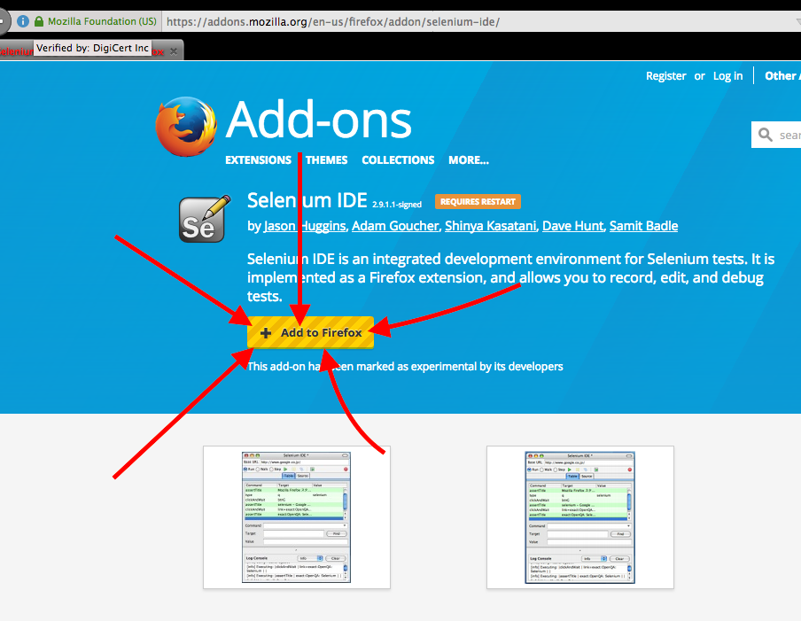
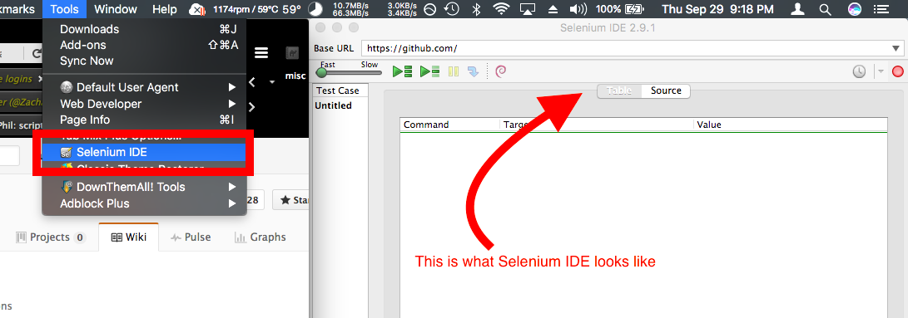

# Vote For Phil
How to automatically vote for Phil 100 times without getting carpal tunnel.

## First, get Selenium IDE for Firefox
Go to https://addons.mozilla.org/en-us/firefox/addon/selenium-ide/ and click the `Add to Firefox button`:  
## Next, open the Selenium
Click on tools then select Selenium IDE: 
* Copy and paste the script into the source tab in the Selenium IDE then press play.  

The script 
https://raw.githubusercontent.com/bj97301/voteForPhil/master/voteForPhilSeleniumScript.html
