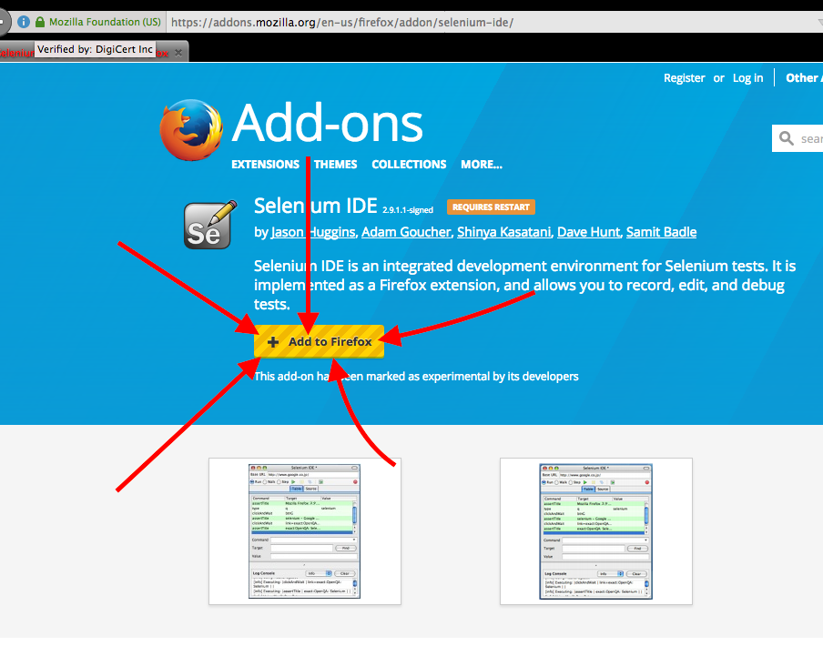

# Vote For Phil
How to automatically vote for Phil 100 times without getting carpal tunnel.

* Get the Selenium IDE for Firefix by going to https://addons.mozilla.org/en-us/firefox/addon/selenium-ide/ and clicking 
* Copy and paste the script into the source tab in the Selenium IDE then press play.  

The script<BR>
```html
<tr>
        <td>open</td>
        <td>http://votedefranco.com</td>
        <td></td>
</tr>
<tr>
        <td>waitForText</td>
        <td>//div[@id='TelescopeWidgetCategoryVote']/div/div/div/div/div/div[2]/ul/li[2]/div/figcaption/span</td>
        <td>Show of the Year</td>
</tr>
<tr>
        <td>click</td>
        <td>//div[@id='TelescopeWidgetCategoryVote']/div/div/div/div/div/div[2]/ul/li[2]/div/figcaption/span</td>
        <td></td>
</tr>
<tr>
        <td>click</td>
        <td>xpath=(//button[@type='button'])[8]</td>
        <td></td>
</tr>
<tr>
        <td>click</td>
        <td>xpath=(//button[@type='button'])[11]</td>
        <td></td>
</tr>
<tr>
        <td>waitForText</td>
        <td>xpath=(//button[@type='button'])[13]</td>
        <td>VOTE AGAIN</td>
</tr>
<tr>
        <td>click</td>
        <td>xpath=(//button[@type='button'])[13]</td>
        <td></td>
</tr>
<tr>
        <td>click</td>
        <td>xpath=(//button[@type='button'])[8]</td>
        <td></td>
</tr>
<tr>
        <td>click</td>
        <td>xpath=(//button[@type='button'])[11]</td>
        <td></td>
</tr>
<tr>
        <td>waitForText</td>
        <td>xpath=(//button[@type='button'])[13]</td>
        <td>VOTE AGAIN</td>
</tr>
<tr>
        <td>click</td>
        <td>xpath=(//button[@type='button'])[13]</td>
        <td></td>
</tr>
<tr>
        <td>click</td>
        <td>xpath=(//button[@type='button'])[8]</td>
        <td></td>
</tr>
<tr>
        <td>click</td>
        <td>xpath=(//button[@type='button'])[11]</td>
        <td></td>
</tr>
<tr>
        <td>waitForText</td>
        <td>xpath=(//button[@type='button'])[13]</td>
        <td>VOTE AGAIN</td>
</tr>
<tr>
        <td>click</td>
        <td>xpath=(//button[@type='button'])[13]</td>
        <td></td>
</tr>
<tr>
        <td>click</td>
        <td>xpath=(//button[@type='button'])[8]</td>
        <td></td>
</tr>
<tr>
        <td>click</td>
        <td>xpath=(//button[@type='button'])[11]</td>
        <td></td>
</tr>
<tr>
        <td>waitForText</td>
        <td>xpath=(//button[@type='button'])[13]</td>
        <td>VOTE AGAIN</td>
</tr>
<tr>
        <td>click</td>
        <td>xpath=(//button[@type='button'])[13]</td>
        <td></td>
</tr>
<tr>
        <td>click</td>
        <td>xpath=(//button[@type='button'])[8]</td>
        <td></td>
</tr>
<tr>
        <td>click</td>
        <td>xpath=(//button[@type='button'])[11]</td>
        <td></td>
</tr>
<tr>
        <td>waitForText</td>
        <td>xpath=(//button[@type='button'])[13]</td>
        <td>VOTE AGAIN</td>
</tr>
<tr>
        <td>click</td>
        <td>xpath=(//button[@type='button'])[13]</td>
        <td></td>
</tr>
<tr>
        <td>click</td>
        <td>xpath=(//button[@type='button'])[8]</td>
        <td></td>
</tr>
<tr>
        <td>click</td>
        <td>xpath=(//button[@type='button'])[11]</td>
        <td></td>
</tr>
<tr>
        <td>waitForText</td>
        <td>xpath=(//button[@type='button'])[13]</td>
        <td>VOTE AGAIN</td>
</tr>
<tr>
        <td>click</td>
        <td>xpath=(//button[@type='button'])[13]</td>
        <td></td>
</tr>
<tr>
        <td>click</td>
        <td>xpath=(//button[@type='button'])[8]</td>
        <td></td>
</tr>
<tr>
        <td>click</td>
        <td>xpath=(//button[@type='button'])[11]</td>
        <td></td>
</tr>
<tr>
        <td>waitForText</td>
        <td>xpath=(//button[@type='button'])[13]</td>
        <td>VOTE AGAIN</td>
</tr>
<tr>
        <td>click</td>
        <td>xpath=(//button[@type='button'])[13]</td>
        <td></td>
</tr>
<tr>
        <td>click</td>
        <td>xpath=(//button[@type='button'])[8]</td>
        <td></td>
</tr>
<tr>
        <td>click</td>
        <td>xpath=(//button[@type='button'])[11]</td>
        <td></td>
</tr>
<tr>
        <td>waitForText</td>
        <td>xpath=(//button[@type='button'])[13]</td>
        <td>VOTE AGAIN</td>
</tr>
<tr>
        <td>click</td>
        <td>xpath=(//button[@type='button'])[13]</td>
        <td></td>
</tr>
<tr>
        <td>click</td>
        <td>xpath=(//button[@type='button'])[8]</td>
        <td></td>
</tr>
<tr>
        <td>click</td>
        <td>xpath=(//button[@type='button'])[11]</td>
        <td></td>
</tr>
<tr>
        <td>waitForText</td>
        <td>xpath=(//button[@type='button'])[13]</td>
        <td>VOTE AGAIN</td>
</tr>
<tr>
        <td>click</td>
        <td>xpath=(//button[@type='button'])[13]</td>
        <td></td>
</tr>
<tr>
        <td>click</td>
        <td>xpath=(//button[@type='button'])[8]</td>
        <td></td>
</tr>
<tr>
        <td>click</td>
        <td>xpath=(//button[@type='button'])[11]</td>
        <td></td>
</tr>
<tr>
        <td>waitForText</td>
        <td>xpath=(//button[@type='button'])[13]</td>
        <td>VOTE AGAIN</td>
</tr>
<tr>
        <td>click</td>
        <td>xpath=(//button[@type='button'])[13]</td>
        <td></td>
</tr>
<tr>
        <td>click</td>
        <td>xpath=(//button[@type='button'])[8]</td>
        <td></td>
</tr>
<tr>
        <td>click</td>
        <td>xpath=(//button[@type='button'])[11]</td>
        <td></td>
</tr>
<tr>
        <td>waitForText</td>
        <td>xpath=(//button[@type='button'])[13]</td>
        <td>VOTE AGAIN</td>
</tr>
<tr>
        <td>click</td>
        <td>xpath=(//button[@type='button'])[13]</td>
        <td></td>
</tr>
<tr>
        <td>click</td>
        <td>xpath=(//button[@type='button'])[8]</td>
        <td></td>
</tr>
<tr>
        <td>click</td>
        <td>xpath=(//button[@type='button'])[11]</td>
        <td></td>
</tr>
<tr>
        <td>waitForText</td>
        <td>xpath=(//button[@type='button'])[13]</td>
        <td>VOTE AGAIN</td>
</tr>
<tr>
        <td>click</td>
        <td>xpath=(//button[@type='button'])[13]</td>
        <td></td>
</tr>
<tr>
        <td>click</td>
        <td>xpath=(//button[@type='button'])[8]</td>
        <td></td>
</tr>
<tr>
        <td>click</td>
        <td>xpath=(//button[@type='button'])[11]</td>
        <td></td>
</tr>
<tr>
        <td>waitForText</td>
        <td>xpath=(//button[@type='button'])[13]</td>
        <td>VOTE AGAIN</td>
</tr>
<tr>
        <td>click</td>
        <td>xpath=(//button[@type='button'])[13]</td>
        <td></td>
</tr>
<tr>
        <td>click</td>
        <td>xpath=(//button[@type='button'])[8]</td>
        <td></td>
</tr>
<tr>
        <td>click</td>
        <td>xpath=(//button[@type='button'])[11]</td>
        <td></td>
</tr>
<tr>
        <td>waitForText</td>
        <td>xpath=(//button[@type='button'])[13]</td>
        <td>VOTE AGAIN</td>
</tr>
<tr>
        <td>click</td>
        <td>xpath=(//button[@type='button'])[13]</td>
        <td></td>
</tr>
<tr>
        <td>click</td>
        <td>xpath=(//button[@type='button'])[8]</td>
        <td></td>
</tr>
<tr>
        <td>click</td>
        <td>xpath=(//button[@type='button'])[11]</td>
        <td></td>
</tr>
<tr>
        <td>waitForText</td>
        <td>xpath=(//button[@type='button'])[13]</td>
        <td>VOTE AGAIN</td>
</tr>
<tr>
        <td>click</td>
        <td>xpath=(//button[@type='button'])[13]</td>
        <td></td>
</tr>
<tr>
        <td>click</td>
        <td>xpath=(//button[@type='button'])[8]</td>
        <td></td>
</tr>
<tr>
        <td>click</td>
        <td>xpath=(//button[@type='button'])[11]</td>
        <td></td>
</tr>
<tr>
        <td>waitForText</td>
        <td>xpath=(//button[@type='button'])[13]</td>
        <td>VOTE AGAIN</td>
</tr>
<tr>
        <td>click</td>
        <td>xpath=(//button[@type='button'])[13]</td>
        <td></td>
</tr>
<tr>
        <td>click</td>
        <td>xpath=(//button[@type='button'])[8]</td>
        <td></td>
</tr>
<tr>
        <td>click</td>
        <td>xpath=(//button[@type='button'])[11]</td>
        <td></td>
</tr>
<tr>
        <td>waitForText</td>
        <td>xpath=(//button[@type='button'])[13]</td>
        <td>VOTE AGAIN</td>
</tr>
<tr>
        <td>click</td>
        <td>xpath=(//button[@type='button'])[13]</td>
        <td></td>
</tr>
<tr>
        <td>click</td>
        <td>xpath=(//button[@type='button'])[8]</td>
        <td></td>
</tr>
<tr>
        <td>click</td>
        <td>xpath=(//button[@type='button'])[11]</td>
        <td></td>
</tr>
<tr>
        <td>waitForText</td>
        <td>xpath=(//button[@type='button'])[13]</td>
        <td>VOTE AGAIN</td>
</tr>
<tr>
        <td>click</td>
        <td>xpath=(//button[@type='button'])[13]</td>
        <td></td>
</tr>
<tr>
        <td>click</td>
        <td>xpath=(//button[@type='button'])[8]</td>
        <td></td>
</tr>
<tr>
        <td>click</td>
        <td>xpath=(//button[@type='button'])[11]</td>
        <td></td>
</tr>
<tr>
        <td>waitForText</td>
        <td>xpath=(//button[@type='button'])[13]</td>
        <td>VOTE AGAIN</td>
</tr>
<tr>
        <td>click</td>
        <td>xpath=(//button[@type='button'])[13]</td>
        <td></td>
</tr>
<tr>
        <td>click</td>
        <td>xpath=(//button[@type='button'])[8]</td>
        <td></td>
</tr>
<tr>
        <td>click</td>
        <td>xpath=(//button[@type='button'])[11]</td>
        <td></td>
</tr>
<tr>
        <td>waitForText</td>
        <td>xpath=(//button[@type='button'])[13]</td>
        <td>VOTE AGAIN</td>
</tr>
<tr>
        <td>click</td>
        <td>xpath=(//button[@type='button'])[13]</td>
        <td></td>
</tr>
<tr>
        <td>click</td>
        <td>xpath=(//button[@type='button'])[8]</td>
        <td></td>
</tr>
<tr>
        <td>click</td>
        <td>xpath=(//button[@type='button'])[11]</td>
        <td></td>
</tr>
<tr>
        <td>waitForText</td>
        <td>xpath=(//button[@type='button'])[13]</td>
        <td>VOTE AGAIN</td>
</tr>
<tr>
        <td>click</td>
        <td>xpath=(//button[@type='button'])[13]</td>
        <td></td>
</tr>
<tr>
        <td>click</td>
        <td>xpath=(//button[@type='button'])[8]</td>
        <td></td>
</tr>
<tr>
        <td>click</td>
        <td>xpath=(//button[@type='button'])[11]</td>
        <td></td>
</tr>
<tr>
        <td>waitForText</td>
        <td>xpath=(//button[@type='button'])[13]</td>
        <td>VOTE AGAIN</td>
</tr>
<tr>
        <td>click</td>
        <td>xpath=(//button[@type='button'])[13]</td>
        <td></td>
</tr>
<tr>
        <td>click</td>
        <td>xpath=(//button[@type='button'])[8]</td>
        <td></td>
</tr>
<tr>
        <td>click</td>
        <td>xpath=(//button[@type='button'])[11]</td>
        <td></td>
</tr>
<tr>
        <td>waitForText</td>
        <td>xpath=(//button[@type='button'])[13]</td>
        <td>VOTE AGAIN</td>
</tr>
<tr>
        <td>click</td>
        <td>xpath=(//button[@type='button'])[13]</td>
        <td></td>
</tr>
<tr>
        <td>click</td>
        <td>xpath=(//button[@type='button'])[8]</td>
        <td></td>
</tr>
<tr>
        <td>click</td>
        <td>xpath=(//button[@type='button'])[11]</td>
        <td></td>
</tr>
<tr>
        <td>waitForText</td>
        <td>xpath=(//button[@type='button'])[13]</td>
        <td>VOTE AGAIN</td>
</tr>
<tr>
        <td>click</td>
        <td>xpath=(//button[@type='button'])[13]</td>
        <td></td>
</tr>
<tr>
        <td>click</td>
        <td>xpath=(//button[@type='button'])[8]</td>
        <td></td>
</tr>
<tr>
        <td>click</td>
        <td>xpath=(//button[@type='button'])[11]</td>
        <td></td>
</tr>
<tr>
        <td>waitForText</td>
        <td>xpath=(//button[@type='button'])[13]</td>
        <td>VOTE AGAIN</td>
</tr>
<tr>
        <td>click</td>
        <td>xpath=(//button[@type='button'])[13]</td>
        <td></td>
</tr>
<tr>
        <td>click</td>
        <td>xpath=(//button[@type='button'])[8]</td>
        <td></td>
</tr>
<tr>
        <td>click</td>
        <td>xpath=(//button[@type='button'])[11]</td>
        <td></td>
</tr>
<tr>
        <td>waitForText</td>
        <td>xpath=(//button[@type='button'])[13]</td>
        <td>VOTE AGAIN</td>
</tr>
<tr>
        <td>click</td>
        <td>xpath=(//button[@type='button'])[13]</td>
        <td></td>
</tr>
<tr>
        <td>click</td>
        <td>xpath=(//button[@type='button'])[8]</td>
        <td></td>
</tr>
<tr>
        <td>click</td>
        <td>xpath=(//button[@type='button'])[11]</td>
        <td></td>
</tr>
<tr>
        <td>waitForText</td>
        <td>xpath=(//button[@type='button'])[13]</td>
        <td>VOTE AGAIN</td>
</tr>
<tr>
        <td>click</td>
        <td>xpath=(//button[@type='button'])[13]</td>
        <td></td>
</tr>
<tr>
        <td>click</td>
        <td>xpath=(//button[@type='button'])[8]</td>
        <td></td>
</tr>
<tr>
        <td>click</td>
        <td>xpath=(//button[@type='button'])[11]</td>
        <td></td>
</tr>
<tr>
        <td>waitForText</td>
        <td>xpath=(//button[@type='button'])[13]</td>
        <td>VOTE AGAIN</td>
</tr>
<tr>
        <td>click</td>
        <td>xpath=(//button[@type='button'])[13]</td>
        <td></td>
</tr>
<tr>
        <td>click</td>
        <td>xpath=(//button[@type='button'])[8]</td>
        <td></td>
</tr>
<tr>
        <td>click</td>
        <td>xpath=(//button[@type='button'])[11]</td>
        <td></td>
</tr>
<tr>
        <td>waitForText</td>
        <td>xpath=(//button[@type='button'])[13]</td>
        <td>VOTE AGAIN</td>
</tr>
<tr>
        <td>click</td>
        <td>xpath=(//button[@type='button'])[13]</td>
        <td></td>
</tr>
<tr>
        <td>click</td>
        <td>xpath=(//button[@type='button'])[8]</td>
        <td></td>
</tr>
<tr>
        <td>click</td>
        <td>xpath=(//button[@type='button'])[11]</td>
        <td></td>
</tr>
<tr>
        <td>waitForText</td>
        <td>xpath=(//button[@type='button'])[13]</td>
        <td>VOTE AGAIN</td>
</tr>
<tr>
        <td>click</td>
        <td>xpath=(//button[@type='button'])[13]</td>
        <td></td>
</tr>
<tr>
        <td>click</td>
        <td>xpath=(//button[@type='button'])[8]</td>
        <td></td>
</tr>
<tr>
        <td>click</td>
        <td>xpath=(//button[@type='button'])[11]</td>
        <td></td>
</tr>
<tr>
        <td>waitForText</td>
        <td>xpath=(//button[@type='button'])[13]</td>
        <td>VOTE AGAIN</td>
</tr>
<tr>
        <td>click</td>
        <td>xpath=(//button[@type='button'])[13]</td>
        <td></td>
</tr>
<tr>
        <td>click</td>
        <td>xpath=(//button[@type='button'])[8]</td>
        <td></td>
</tr>
<tr>
        <td>click</td>
        <td>xpath=(//button[@type='button'])[11]</td>
        <td></td>
</tr>
<tr>
        <td>waitForText</td>
        <td>xpath=(//button[@type='button'])[13]</td>
        <td>VOTE AGAIN</td>
</tr>
<tr>
        <td>click</td>
        <td>xpath=(//button[@type='button'])[13]</td>
        <td></td>
</tr>
<tr>
        <td>click</td>
        <td>xpath=(//button[@type='button'])[8]</td>
        <td></td>
</tr>
<tr>
        <td>click</td>
        <td>xpath=(//button[@type='button'])[11]</td>
        <td></td>
</tr>
<tr>
        <td>waitForText</td>
        <td>xpath=(//button[@type='button'])[13]</td>
        <td>VOTE AGAIN</td>
</tr>
<tr>
        <td>click</td>
        <td>xpath=(//button[@type='button'])[13]</td>
        <td></td>
</tr>
<tr>
        <td>click</td>
        <td>xpath=(//button[@type='button'])[8]</td>
        <td></td>
</tr>
<tr>
        <td>click</td>
        <td>xpath=(//button[@type='button'])[11]</td>
        <td></td>
</tr>
<tr>
        <td>waitForText</td>
        <td>xpath=(//button[@type='button'])[13]</td>
        <td>VOTE AGAIN</td>
</tr>
<tr>
        <td>click</td>
        <td>xpath=(//button[@type='button'])[13]</td>
        <td></td>
</tr>
<tr>
        <td>click</td>
        <td>xpath=(//button[@type='button'])[8]</td>
        <td></td>
</tr>
<tr>
        <td>click</td>
        <td>xpath=(//button[@type='button'])[11]</td>
        <td></td>
</tr>
<tr>
        <td>waitForText</td>
        <td>xpath=(//button[@type='button'])[13]</td>
        <td>VOTE AGAIN</td>
</tr>
<tr>
        <td>click</td>
        <td>xpath=(//button[@type='button'])[13]</td>
        <td></td>
</tr>
<tr>
        <td>click</td>
        <td>xpath=(//button[@type='button'])[8]</td>
        <td></td>
</tr>
<tr>
        <td>click</td>
        <td>xpath=(//button[@type='button'])[11]</td>
        <td></td>
</tr>
<tr>
        <td>waitForText</td>
        <td>xpath=(//button[@type='button'])[13]</td>
        <td>VOTE AGAIN</td>
</tr>
<tr>
        <td>click</td>
        <td>xpath=(//button[@type='button'])[13]</td>
        <td></td>
</tr>
<tr>
        <td>click</td>
        <td>xpath=(//button[@type='button'])[8]</td>
        <td></td>
</tr>
<tr>
        <td>click</td>
        <td>xpath=(//button[@type='button'])[11]</td>
        <td></td>
</tr>
<tr>
        <td>waitForText</td>
        <td>xpath=(//button[@type='button'])[13]</td>
        <td>VOTE AGAIN</td>
</tr>
<tr>
        <td>click</td>
        <td>xpath=(//button[@type='button'])[13]</td>
        <td></td>
</tr>
<tr>
        <td>click</td>
        <td>xpath=(//button[@type='button'])[8]</td>
        <td></td>
</tr>
<tr>
        <td>click</td>
        <td>xpath=(//button[@type='button'])[11]</td>
        <td></td>
</tr>
<tr>
        <td>waitForText</td>
        <td>xpath=(//button[@type='button'])[13]</td>
        <td>VOTE AGAIN</td>
</tr>
<tr>
        <td>click</td>
        <td>xpath=(//button[@type='button'])[13]</td>
        <td></td>
</tr>
<tr>
        <td>click</td>
        <td>xpath=(//button[@type='button'])[8]</td>
        <td></td>
</tr>
<tr>
        <td>click</td>
        <td>xpath=(//button[@type='button'])[11]</td>
        <td></td>
</tr>
<tr>
        <td>waitForText</td>
        <td>xpath=(//button[@type='button'])[13]</td>
        <td>VOTE AGAIN</td>
</tr>
<tr>
        <td>click</td>
        <td>xpath=(//button[@type='button'])[13]</td>
        <td></td>
</tr>
<tr>
        <td>click</td>
        <td>xpath=(//button[@type='button'])[8]</td>
        <td></td>
</tr>
<tr>
        <td>click</td>
        <td>xpath=(//button[@type='button'])[11]</td>
        <td></td>
</tr>
<tr>
        <td>waitForText</td>
        <td>xpath=(//button[@type='button'])[13]</td>
        <td>VOTE AGAIN</td>
</tr>
<tr>
        <td>click</td>
        <td>xpath=(//button[@type='button'])[13]</td>
        <td></td>
</tr>
<tr>
        <td>click</td>
        <td>xpath=(//button[@type='button'])[8]</td>
        <td></td>
</tr>
<tr>
        <td>click</td>
        <td>xpath=(//button[@type='button'])[11]</td>
        <td></td>
</tr>
<tr>
        <td>waitForText</td>
        <td>xpath=(//button[@type='button'])[13]</td>
        <td>VOTE AGAIN</td>
</tr>
<tr>
        <td>click</td>
        <td>xpath=(//button[@type='button'])[13]</td>
        <td></td>
</tr>
<tr>
        <td>click</td>
        <td>xpath=(//button[@type='button'])[8]</td>
        <td></td>
</tr>
<tr>
        <td>click</td>
        <td>xpath=(//button[@type='button'])[11]</td>
        <td></td>
</tr>
<tr>
        <td>waitForText</td>
        <td>xpath=(//button[@type='button'])[13]</td>
        <td>VOTE AGAIN</td>
</tr>
<tr>
        <td>click</td>
        <td>xpath=(//button[@type='button'])[13]</td>
        <td></td>
</tr>
<tr>
        <td>click</td>
        <td>xpath=(//button[@type='button'])[8]</td>
        <td></td>
</tr>
<tr>
        <td>click</td>
        <td>xpath=(//button[@type='button'])[11]</td>
        <td></td>
</tr>
<tr>
        <td>waitForText</td>
        <td>xpath=(//button[@type='button'])[13]</td>
        <td>VOTE AGAIN</td>
</tr>
<tr>
        <td>click</td>
        <td>xpath=(//button[@type='button'])[13]</td>
        <td></td>
</tr>
<tr>
        <td>click</td>
        <td>xpath=(//button[@type='button'])[8]</td>
        <td></td>
</tr>
<tr>
        <td>click</td>
        <td>xpath=(//button[@type='button'])[11]</td>
        <td></td>
</tr>
<tr>
        <td>waitForText</td>
        <td>xpath=(//button[@type='button'])[13]</td>
        <td>VOTE AGAIN</td>
</tr>
<tr>
        <td>click</td>
        <td>xpath=(//button[@type='button'])[13]</td>
        <td></td>
</tr>
<tr>
        <td>click</td>
        <td>xpath=(//button[@type='button'])[8]</td>
        <td></td>
</tr>
<tr>
        <td>click</td>
        <td>xpath=(//button[@type='button'])[11]</td>
        <td></td>
</tr>
<tr>
        <td>waitForText</td>
        <td>xpath=(//button[@type='button'])[13]</td>
        <td>VOTE AGAIN</td>
</tr>
<tr>
        <td>click</td>
        <td>xpath=(//button[@type='button'])[13]</td>
        <td></td>
</tr>
<tr>
        <td>click</td>
        <td>xpath=(//button[@type='button'])[8]</td>
        <td></td>
</tr>
<tr>
        <td>click</td>
        <td>xpath=(//button[@type='button'])[11]</td>
        <td></td>
</tr>
<tr>
        <td>waitForText</td>
        <td>xpath=(//button[@type='button'])[13]</td>
        <td>VOTE AGAIN</td>
</tr>
<tr>
        <td>click</td>
        <td>xpath=(//button[@type='button'])[13]</td>
        <td></td>
</tr>
<tr>
        <td>click</td>
        <td>xpath=(//button[@type='button'])[8]</td>
        <td></td>
</tr>
<tr>
        <td>click</td>
        <td>xpath=(//button[@type='button'])[11]</td>
        <td></td>
</tr>
<tr>
        <td>waitForText</td>
        <td>xpath=(//button[@type='button'])[13]</td>
        <td>VOTE AGAIN</td>
</tr>
<tr>
        <td>click</td>
        <td>xpath=(//button[@type='button'])[13]</td>
        <td></td>
</tr>
<tr>
        <td>click</td>
        <td>xpath=(//button[@type='button'])[8]</td>
        <td></td>
</tr>
<tr>
        <td>click</td>
        <td>xpath=(//button[@type='button'])[11]</td>
        <td></td>
</tr>
<tr>
        <td>waitForText</td>
        <td>xpath=(//button[@type='button'])[13]</td>
        <td>VOTE AGAIN</td>
</tr>
<tr>
        <td>click</td>
        <td>xpath=(//button[@type='button'])[13]</td>
        <td></td>
</tr>
<tr>
        <td>click</td>
        <td>xpath=(//button[@type='button'])[8]</td>
        <td></td>
</tr>
<tr>
        <td>click</td>
        <td>xpath=(//button[@type='button'])[11]</td>
        <td></td>
</tr>
<tr>
        <td>waitForText</td>
        <td>xpath=(//button[@type='button'])[13]</td>
        <td>VOTE AGAIN</td>
</tr>
<tr>
        <td>click</td>
        <td>xpath=(//button[@type='button'])[13]</td>
        <td></td>
</tr>
<tr>
        <td>click</td>
        <td>xpath=(//button[@type='button'])[8]</td>
        <td></td>
</tr>
<tr>
        <td>click</td>
        <td>xpath=(//button[@type='button'])[11]</td>
        <td></td>
</tr>
<tr>
        <td>waitForText</td>
        <td>xpath=(//button[@type='button'])[13]</td>
        <td>VOTE AGAIN</td>
</tr>
<tr>
        <td>click</td>
        <td>xpath=(//button[@type='button'])[13]</td>
        <td></td>
</tr>
<tr>
        <td>click</td>
        <td>xpath=(//button[@type='button'])[8]</td>
        <td></td>
</tr>
<tr>
        <td>click</td>
        <td>xpath=(//button[@type='button'])[11]</td>
        <td></td>
</tr>
<tr>
        <td>waitForText</td>
        <td>xpath=(//button[@type='button'])[13]</td>
        <td>VOTE AGAIN</td>
</tr>
<tr>
        <td>click</td>
        <td>xpath=(//button[@type='button'])[13]</td>
        <td></td>
</tr>
<tr>
        <td>click</td>
        <td>xpath=(//button[@type='button'])[8]</td>
        <td></td>
</tr>
<tr>
        <td>click</td>
        <td>xpath=(//button[@type='button'])[11]</td>
        <td></td>
</tr>
<tr>
        <td>waitForText</td>
        <td>xpath=(//button[@type='button'])[13]</td>
        <td>VOTE AGAIN</td>
</tr>
<tr>
        <td>click</td>
        <td>xpath=(//button[@type='button'])[13]</td>
        <td></td>
</tr>
<tr>
        <td>click</td>
        <td>xpath=(//button[@type='button'])[8]</td>
        <td></td>
</tr>
<tr>
        <td>click</td>
        <td>xpath=(//button[@type='button'])[11]</td>
        <td></td>
</tr>
<tr>
        <td>waitForText</td>
        <td>xpath=(//button[@type='button'])[13]</td>
        <td>VOTE AGAIN</td>
</tr>
<tr>
        <td>click</td>
        <td>xpath=(//button[@type='button'])[13]</td>
        <td></td>
</tr>
<tr>
        <td>click</td>
        <td>xpath=(//button[@type='button'])[8]</td>
        <td></td>
</tr>
<tr>
        <td>click</td>
        <td>xpath=(//button[@type='button'])[11]</td>
        <td></td>
</tr>
<tr>
        <td>waitForText</td>
        <td>xpath=(//button[@type='button'])[13]</td>
        <td>VOTE AGAIN</td>
</tr>
<tr>
        <td>click</td>
        <td>xpath=(//button[@type='button'])[13]</td>
        <td></td>
</tr>
<tr>
        <td>click</td>
        <td>xpath=(//button[@type='button'])[8]</td>
        <td></td>
</tr>
<tr>
        <td>click</td>
        <td>xpath=(//button[@type='button'])[11]</td>
        <td></td>
</tr>
<tr>
        <td>waitForText</td>
        <td>xpath=(//button[@type='button'])[13]</td>
        <td>VOTE AGAIN</td>
</tr>
<tr>
        <td>click</td>
        <td>xpath=(//button[@type='button'])[13]</td>
        <td></td>
</tr>
<tr>
        <td>click</td>
        <td>xpath=(//button[@type='button'])[8]</td>
        <td></td>
</tr>
<tr>
        <td>click</td>
        <td>xpath=(//button[@type='button'])[11]</td>
        <td></td>
</tr>
<tr>
        <td>waitForText</td>
        <td>xpath=(//button[@type='button'])[13]</td>
        <td>VOTE AGAIN</td>
</tr>
<tr>
        <td>click</td>
        <td>xpath=(//button[@type='button'])[13]</td>
        <td></td>
</tr>
<tr>
        <td>click</td>
        <td>xpath=(//button[@type='button'])[8]</td>
        <td></td>
</tr>
<tr>
        <td>click</td>
        <td>xpath=(//button[@type='button'])[11]</td>
        <td></td>
</tr>
<tr>
        <td>waitForText</td>
        <td>xpath=(//button[@type='button'])[13]</td>
        <td>VOTE AGAIN</td>
</tr>
<tr>
        <td>click</td>
        <td>xpath=(//button[@type='button'])[13]</td>
        <td></td>
</tr>
<tr>
        <td>click</td>
        <td>xpath=(//button[@type='button'])[8]</td>
        <td></td>
</tr>
<tr>
        <td>click</td>
        <td>xpath=(//button[@type='button'])[11]</td>
        <td></td>
</tr>
<tr>
        <td>waitForText</td>
        <td>xpath=(//button[@type='button'])[13]</td>
        <td>VOTE AGAIN</td>
</tr>
<tr>
        <td>click</td>
        <td>xpath=(//button[@type='button'])[13]</td>
        <td></td>
</tr>
<tr>
        <td>click</td>
        <td>xpath=(//button[@type='button'])[8]</td>
        <td></td>
</tr>
<tr>
        <td>click</td>
        <td>xpath=(//button[@type='button'])[11]</td>
        <td></td>
</tr>
<tr>
        <td>waitForText</td>
        <td>xpath=(//button[@type='button'])[13]</td>
        <td>VOTE AGAIN</td>
</tr>
<tr>
        <td>click</td>
        <td>xpath=(//button[@type='button'])[13]</td>
        <td></td>
</tr>
<tr>
        <td>click</td>
        <td>xpath=(//button[@type='button'])[8]</td>
        <td></td>
</tr>
<tr>
        <td>click</td>
        <td>xpath=(//button[@type='button'])[11]</td>
        <td></td>
</tr>
<tr>
        <td>waitForText</td>
        <td>xpath=(//button[@type='button'])[13]</td>
        <td>VOTE AGAIN</td>
</tr>
<tr>
        <td>click</td>
        <td>xpath=(//button[@type='button'])[13]</td>
        <td></td>
</tr>
<tr>
        <td>click</td>
        <td>xpath=(//button[@type='button'])[8]</td>
        <td></td>
</tr>
<tr>
        <td>click</td>
        <td>xpath=(//button[@type='button'])[11]</td>
        <td></td>
</tr>
<tr>
        <td>waitForText</td>
        <td>xpath=(//button[@type='button'])[13]</td>
        <td>VOTE AGAIN</td>
</tr>
<tr>
        <td>click</td>
        <td>xpath=(//button[@type='button'])[13]</td>
        <td></td>
</tr>
<tr>
        <td>click</td>
        <td>xpath=(//button[@type='button'])[8]</td>
        <td></td>
</tr>
<tr>
        <td>click</td>
        <td>xpath=(//button[@type='button'])[11]</td>
        <td></td>
</tr>
<tr>
        <td>waitForText</td>
        <td>xpath=(//button[@type='button'])[13]</td>
        <td>VOTE AGAIN</td>
</tr>
<tr>
        <td>click</td>
        <td>xpath=(//button[@type='button'])[13]</td>
        <td></td>
</tr>
<tr>
        <td>click</td>
        <td>xpath=(//button[@type='button'])[8]</td>
        <td></td>
</tr>
<tr>
        <td>click</td>
        <td>xpath=(//button[@type='button'])[11]</td>
        <td></td>
</tr>
<tr>
        <td>waitForText</td>
        <td>xpath=(//button[@type='button'])[13]</td>
        <td>VOTE AGAIN</td>
</tr>
<tr>
        <td>click</td>
        <td>xpath=(//button[@type='button'])[13]</td>
        <td></td>
</tr>
<tr>
        <td>click</td>
        <td>xpath=(//button[@type='button'])[8]</td>
        <td></td>
</tr>
<tr>
        <td>click</td>
        <td>xpath=(//button[@type='button'])[11]</td>
        <td></td>
</tr>
<tr>
        <td>waitForText</td>
        <td>xpath=(//button[@type='button'])[13]</td>
        <td>VOTE AGAIN</td>
</tr>
<tr>
        <td>click</td>
        <td>xpath=(//button[@type='button'])[13]</td>
        <td></td>
</tr>
<tr>
        <td>click</td>
        <td>xpath=(//button[@type='button'])[8]</td>
        <td></td>
</tr>
<tr>
        <td>click</td>
        <td>xpath=(//button[@type='button'])[11]</td>
        <td></td>
</tr>
<tr>
        <td>waitForText</td>
        <td>xpath=(//button[@type='button'])[13]</td>
        <td>VOTE AGAIN</td>
</tr>
<tr>
        <td>click</td>
        <td>xpath=(//button[@type='button'])[13]</td>
        <td></td>
</tr>
<tr>
        <td>click</td>
        <td>xpath=(//button[@type='button'])[8]</td>
        <td></td>
</tr>
<tr>
        <td>click</td>
        <td>xpath=(//button[@type='button'])[11]</td>
        <td></td>
</tr>
<tr>
        <td>waitForText</td>
        <td>xpath=(//button[@type='button'])[13]</td>
        <td>VOTE AGAIN</td>
</tr>
<tr>
        <td>click</td>
        <td>xpath=(//button[@type='button'])[13]</td>
        <td></td>
</tr>
<tr>
        <td>click</td>
        <td>xpath=(//button[@type='button'])[8]</td>
        <td></td>
</tr>
<tr>
        <td>click</td>
        <td>xpath=(//button[@type='button'])[11]</td>
        <td></td>
</tr>
<tr>
        <td>waitForText</td>
        <td>xpath=(//button[@type='button'])[13]</td>
        <td>VOTE AGAIN</td>
</tr>
<tr>
        <td>click</td>
        <td>xpath=(//button[@type='button'])[13]</td>
        <td></td>
</tr>
<tr>
        <td>click</td>
        <td>xpath=(//button[@type='button'])[8]</td>
        <td></td>
</tr>
<tr>
        <td>click</td>
        <td>xpath=(//button[@type='button'])[11]</td>
        <td></td>
</tr>
<tr>
        <td>waitForText</td>
        <td>xpath=(//button[@type='button'])[13]</td>
        <td>VOTE AGAIN</td>
</tr>
<tr>
        <td>click</td>
        <td>xpath=(//button[@type='button'])[13]</td>
        <td></td>
</tr>
<tr>
        <td>click</td>
        <td>xpath=(//button[@type='button'])[8]</td>
        <td></td>
</tr>
<tr>
        <td>click</td>
        <td>xpath=(//button[@type='button'])[11]</td>
        <td></td>
</tr>
<tr>
        <td>waitForText</td>
        <td>xpath=(//button[@type='button'])[13]</td>
        <td>VOTE AGAIN</td>
</tr>
<tr>
        <td>click</td>
        <td>xpath=(//button[@type='button'])[13]</td>
        <td></td>
</tr>
<tr>
        <td>click</td>
        <td>xpath=(//button[@type='button'])[8]</td>
        <td></td>
</tr>
<tr>
        <td>click</td>
        <td>xpath=(//button[@type='button'])[11]</td>
        <td></td>
</tr>
<tr>
        <td>waitForText</td>
        <td>xpath=(//button[@type='button'])[13]</td>
        <td>VOTE AGAIN</td>
</tr>
<tr>
        <td>click</td>
        <td>xpath=(//button[@type='button'])[13]</td>
        <td></td>
</tr>
<tr>
        <td>click</td>
        <td>xpath=(//button[@type='button'])[8]</td>
        <td></td>
</tr>
<tr>
        <td>click</td>
        <td>xpath=(//button[@type='button'])[11]</td>
        <td></td>
</tr>
<tr>
        <td>waitForText</td>
        <td>xpath=(//button[@type='button'])[13]</td>
        <td>VOTE AGAIN</td>
</tr>
<tr>
        <td>click</td>
        <td>xpath=(//button[@type='button'])[13]</td>
        <td></td>
</tr>
<tr>
        <td>click</td>
        <td>xpath=(//button[@type='button'])[8]</td>
        <td></td>
</tr>
<tr>
        <td>click</td>
        <td>xpath=(//button[@type='button'])[11]</td>
        <td></td>
</tr>
<tr>
        <td>waitForText</td>
        <td>xpath=(//button[@type='button'])[13]</td>
        <td>VOTE AGAIN</td>
</tr>
<tr>
        <td>click</td>
        <td>xpath=(//button[@type='button'])[13]</td>
        <td></td>
</tr>
<tr>
        <td>click</td>
        <td>xpath=(//button[@type='button'])[8]</td>
        <td></td>
</tr>
<tr>
        <td>click</td>
        <td>xpath=(//button[@type='button'])[11]</td>
        <td></td>
</tr>
<tr>
        <td>waitForText</td>
        <td>xpath=(//button[@type='button'])[13]</td>
        <td>VOTE AGAIN</td>
</tr>
<tr>
        <td>click</td>
        <td>xpath=(//button[@type='button'])[13]</td>
        <td></td>
</tr>
<tr>
        <td>click</td>
        <td>xpath=(//button[@type='button'])[8]</td>
        <td></td>
</tr>
<tr>
        <td>click</td>
        <td>xpath=(//button[@type='button'])[11]</td>
        <td></td>
</tr>
<tr>
        <td>waitForText</td>
        <td>xpath=(//button[@type='button'])[13]</td>
        <td>VOTE AGAIN</td>
</tr>
<tr>
        <td>click</td>
        <td>xpath=(//button[@type='button'])[13]</td>
        <td></td>
</tr>
<tr>
        <td>click</td>
        <td>xpath=(//button[@type='button'])[8]</td>
        <td></td>
</tr>
<tr>
        <td>click</td>
        <td>xpath=(//button[@type='button'])[11]</td>
        <td></td>
</tr>
<tr>
        <td>waitForText</td>
        <td>xpath=(//button[@type='button'])[13]</td>
        <td>VOTE AGAIN</td>
</tr>
<tr>
        <td>click</td>
        <td>xpath=(//button[@type='button'])[13]</td>
        <td></td>
</tr>
<tr>
        <td>click</td>
        <td>xpath=(//button[@type='button'])[8]</td>
        <td></td>
</tr>
<tr>
        <td>click</td>
        <td>xpath=(//button[@type='button'])[11]</td>
        <td></td>
</tr>
<tr>
        <td>waitForText</td>
        <td>xpath=(//button[@type='button'])[13]</td>
        <td>VOTE AGAIN</td>
</tr>
<tr>
        <td>click</td>
        <td>xpath=(//button[@type='button'])[13]</td>
        <td></td>
</tr>
<tr>
        <td>click</td>
        <td>xpath=(//button[@type='button'])[8]</td>
        <td></td>
</tr>
<tr>
        <td>click</td>
        <td>xpath=(//button[@type='button'])[11]</td>
        <td></td>
</tr>
<tr>
        <td>waitForText</td>
        <td>xpath=(//button[@type='button'])[13]</td>
        <td>VOTE AGAIN</td>
</tr>
<tr>
        <td>click</td>
        <td>xpath=(//button[@type='button'])[13]</td>
        <td></td>
</tr>
<tr>
        <td>click</td>
        <td>xpath=(//button[@type='button'])[8]</td>
        <td></td>
</tr>
<tr>
        <td>click</td>
        <td>xpath=(//button[@type='button'])[11]</td>
        <td></td>
</tr>
<tr>
        <td>waitForText</td>
        <td>xpath=(//button[@type='button'])[13]</td>
        <td>VOTE AGAIN</td>
</tr>
<tr>
        <td>click</td>
        <td>xpath=(//button[@type='button'])[13]</td>
        <td></td>
</tr>
<tr>
        <td>click</td>
        <td>xpath=(//button[@type='button'])[8]</td>
        <td></td>
</tr>
<tr>
        <td>click</td>
        <td>xpath=(//button[@type='button'])[11]</td>
        <td></td>
</tr>
<tr>
        <td>waitForText</td>
        <td>xpath=(//button[@type='button'])[13]</td>
        <td>VOTE AGAIN</td>
</tr>
<tr>
        <td>click</td>
        <td>xpath=(//button[@type='button'])[13]</td>
        <td></td>
</tr>
<tr>
        <td>click</td>
        <td>xpath=(//button[@type='button'])[8]</td>
        <td></td>
</tr>
<tr>
        <td>click</td>
        <td>xpath=(//button[@type='button'])[11]</td>
        <td></td>
</tr>
<tr>
        <td>waitForText</td>
        <td>xpath=(//button[@type='button'])[13]</td>
        <td>VOTE AGAIN</td>
</tr>
<tr>
        <td>click</td>
        <td>xpath=(//button[@type='button'])[13]</td>
        <td></td>
</tr>
<tr>
        <td>click</td>
        <td>xpath=(//button[@type='button'])[8]</td>
        <td></td>
</tr>
<tr>
        <td>click</td>
        <td>xpath=(//button[@type='button'])[11]</td>
        <td></td>
</tr>
<tr>
        <td>waitForText</td>
        <td>xpath=(//button[@type='button'])[13]</td>
        <td>VOTE AGAIN</td>
</tr>
<tr>
        <td>click</td>
        <td>xpath=(//button[@type='button'])[13]</td>
        <td></td>
</tr>
<tr>
        <td>click</td>
        <td>xpath=(//button[@type='button'])[8]</td>
        <td></td>
</tr>
<tr>
        <td>click</td>
        <td>xpath=(//button[@type='button'])[11]</td>
        <td></td>
</tr>
<tr>
        <td>waitForText</td>
        <td>xpath=(//button[@type='button'])[13]</td>
        <td>VOTE AGAIN</td>
</tr>
<tr>
        <td>click</td>
        <td>xpath=(//button[@type='button'])[13]</td>
        <td></td>
</tr>
<tr>
        <td>click</td>
        <td>xpath=(//button[@type='button'])[8]</td>
        <td></td>
</tr>
<tr>
        <td>click</td>
        <td>xpath=(//button[@type='button'])[11]</td>
        <td></td>
</tr>
<tr>
        <td>waitForText</td>
        <td>xpath=(//button[@type='button'])[13]</td>
        <td>VOTE AGAIN</td>
</tr>
<tr>
        <td>click</td>
        <td>xpath=(//button[@type='button'])[13]</td>
        <td></td>
</tr>
<tr>
        <td>click</td>
        <td>xpath=(//button[@type='button'])[8]</td>
        <td></td>
</tr>
<tr>
        <td>click</td>
        <td>xpath=(//button[@type='button'])[11]</td>
        <td></td>
</tr>
<tr>
        <td>waitForText</td>
        <td>xpath=(//button[@type='button'])[13]</td>
        <td>VOTE AGAIN</td>
</tr>
<tr>
        <td>click</td>
        <td>xpath=(//button[@type='button'])[13]</td>
        <td></td>
</tr>
<tr>
        <td>click</td>
        <td>xpath=(//button[@type='button'])[8]</td>
        <td></td>
</tr>
<tr>
        <td>click</td>
        <td>xpath=(//button[@type='button'])[11]</td>
        <td></td>
</tr>
<tr>
        <td>waitForText</td>
        <td>xpath=(//button[@type='button'])[13]</td>
        <td>VOTE AGAIN</td>
</tr>
<tr>
        <td>click</td>
        <td>xpath=(//button[@type='button'])[13]</td>
        <td></td>
</tr>
<tr>
        <td>click</td>
        <td>xpath=(//button[@type='button'])[8]</td>
        <td></td>
</tr>
<tr>
        <td>click</td>
        <td>xpath=(//button[@type='button'])[11]</td>
        <td></td>
</tr>
<tr>
        <td>waitForText</td>
        <td>xpath=(//button[@type='button'])[13]</td>
        <td>VOTE AGAIN</td>
</tr>
<tr>
        <td>click</td>
        <td>xpath=(//button[@type='button'])[13]</td>
        <td></td>
</tr>
<tr>
        <td>click</td>
        <td>xpath=(//button[@type='button'])[8]</td>
        <td></td>
</tr>
<tr>
        <td>click</td>
        <td>xpath=(//button[@type='button'])[11]</td>
        <td></td>
</tr>
<tr>
        <td>waitForText</td>
        <td>xpath=(//button[@type='button'])[13]</td>
        <td>VOTE AGAIN</td>
</tr>
<tr>
        <td>click</td>
        <td>xpath=(//button[@type='button'])[13]</td>
        <td></td>
</tr>
<tr>
        <td>click</td>
        <td>xpath=(//button[@type='button'])[8]</td>
        <td></td>
</tr>
<tr>
        <td>click</td>
        <td>xpath=(//button[@type='button'])[11]</td>
        <td></td>
</tr>
<tr>
        <td>waitForText</td>
        <td>xpath=(//button[@type='button'])[13]</td>
        <td>VOTE AGAIN</td>
</tr>
<tr>
        <td>click</td>
        <td>xpath=(//button[@type='button'])[13]</td>
        <td></td>
</tr>
<tr>
        <td>click</td>
        <td>xpath=(//button[@type='button'])[8]</td>
        <td></td>
</tr>
<tr>
        <td>click</td>
        <td>xpath=(//button[@type='button'])[11]</td>
        <td></td>
</tr>
<tr>
        <td>waitForText</td>
        <td>xpath=(//button[@type='button'])[13]</td>
        <td>VOTE AGAIN</td>
</tr>
<tr>
        <td>click</td>
        <td>xpath=(//button[@type='button'])[13]</td>
        <td></td>
</tr>
<tr>
        <td>click</td>
        <td>xpath=(//button[@type='button'])[8]</td>
        <td></td>
</tr>
<tr>
        <td>click</td>
        <td>xpath=(//button[@type='button'])[11]</td>
        <td></td>
</tr>
<tr>
        <td>waitForText</td>
        <td>xpath=(//button[@type='button'])[13]</td>
        <td>VOTE AGAIN</td>
</tr>
<tr>
        <td>click</td>
        <td>xpath=(//button[@type='button'])[13]</td>
        <td></td>
</tr>
<tr>
        <td>click</td>
        <td>xpath=(//button[@type='button'])[8]</td>
        <td></td>
</tr>
<tr>
        <td>click</td>
        <td>xpath=(//button[@type='button'])[11]</td>
        <td></td>
</tr>
<tr>
        <td>waitForText</td>
        <td>xpath=(//button[@type='button'])[13]</td>
        <td>VOTE AGAIN</td>
</tr>
<tr>
        <td>click</td>
        <td>xpath=(//button[@type='button'])[13]</td>
        <td></td>
</tr>
<tr>
        <td>click</td>
        <td>xpath=(//button[@type='button'])[8]</td>
        <td></td>
</tr>
<tr>
        <td>click</td>
        <td>xpath=(//button[@type='button'])[11]</td>
        <td></td>
</tr>
<tr>
        <td>waitForText</td>
        <td>xpath=(//button[@type='button'])[13]</td>
        <td>VOTE AGAIN</td>
</tr>
<tr>
        <td>click</td>
        <td>xpath=(//button[@type='button'])[13]</td>
        <td></td>
</tr>
<tr>
        <td>click</td>
        <td>xpath=(//button[@type='button'])[8]</td>
        <td></td>
</tr>
<tr>
        <td>click</td>
        <td>xpath=(//button[@type='button'])[11]</td>
        <td></td>
</tr>
<tr>
        <td>waitForText</td>
        <td>xpath=(//button[@type='button'])[13]</td>
        <td>VOTE AGAIN</td>
</tr>
<tr>
        <td>click</td>
        <td>xpath=(//button[@type='button'])[13]</td>
        <td></td>
</tr>
<tr>
        <td>click</td>
        <td>xpath=(//button[@type='button'])[8]</td>
        <td></td>
</tr>
<tr>
        <td>click</td>
        <td>xpath=(//button[@type='button'])[11]</td>
        <td></td>
</tr>
<tr>
        <td>waitForText</td>
        <td>xpath=(//button[@type='button'])[13]</td>
        <td>VOTE AGAIN</td>
</tr>
<tr>
        <td>click</td>
        <td>xpath=(//button[@type='button'])[13]</td>
        <td></td>
</tr>
<tr>
        <td>click</td>
        <td>xpath=(//button[@type='button'])[8]</td>
        <td></td>
</tr>
<tr>
        <td>click</td>
        <td>xpath=(//button[@type='button'])[11]</td>
        <td></td>
</tr>
<tr>
        <td>waitForText</td>
        <td>xpath=(//button[@type='button'])[13]</td>
        <td>VOTE AGAIN</td>
</tr>
<tr>
        <td>click</td>
        <td>xpath=(//button[@type='button'])[13]</td>
        <td></td>
</tr>
<tr>
        <td>click</td>
        <td>xpath=(//button[@type='button'])[8]</td>
        <td></td>
</tr>
<tr>
        <td>click</td>
        <td>xpath=(//button[@type='button'])[11]</td>
        <td></td>
</tr>
<tr>
        <td>waitForText</td>
        <td>xpath=(//button[@type='button'])[13]</td>
        <td>VOTE AGAIN</td>
</tr>
<tr>
        <td>click</td>
        <td>xpath=(//button[@type='button'])[13]</td>
        <td></td>
</tr>
<tr>
        <td>click</td>
        <td>xpath=(//button[@type='button'])[8]</td>
        <td></td>
</tr>
<tr>
        <td>click</td>
        <td>xpath=(//button[@type='button'])[11]</td>
        <td></td>
</tr>
<tr>
        <td>waitForText</td>
        <td>xpath=(//button[@type='button'])[13]</td>
        <td>VOTE AGAIN</td>
</tr>
<tr>
        <td>click</td>
        <td>xpath=(//button[@type='button'])[13]</td>
        <td></td>
</tr>
<tr>
        <td>click</td>
        <td>xpath=(//button[@type='button'])[8]</td>
        <td></td>
</tr>
<tr>
        <td>click</td>
        <td>xpath=(//button[@type='button'])[11]</td>
        <td></td>
</tr>
<tr>
        <td>waitForText</td>
        <td>xpath=(//button[@type='button'])[13]</td>
        <td>VOTE AGAIN</td>
</tr>
<tr>
        <td>click</td>
        <td>xpath=(//button[@type='button'])[13]</td>
        <td></td>
</tr>
<tr>
        <td>click</td>
        <td>xpath=(//button[@type='button'])[8]</td>
        <td></td>
</tr>
<tr>
        <td>click</td>
        <td>xpath=(//button[@type='button'])[11]</td>
        <td></td>
</tr>
<tr>
        <td>waitForText</td>
        <td>xpath=(//button[@type='button'])[13]</td>
        <td>VOTE AGAIN</td>
</tr>
<tr>
        <td>click</td>
        <td>xpath=(//button[@type='button'])[13]</td>
        <td></td>
</tr>
<tr>
        <td>click</td>
        <td>xpath=(//button[@type='button'])[8]</td>
        <td></td>
</tr>
<tr>
        <td>click</td>
        <td>xpath=(//button[@type='button'])[11]</td>
        <td></td>
</tr>

```
