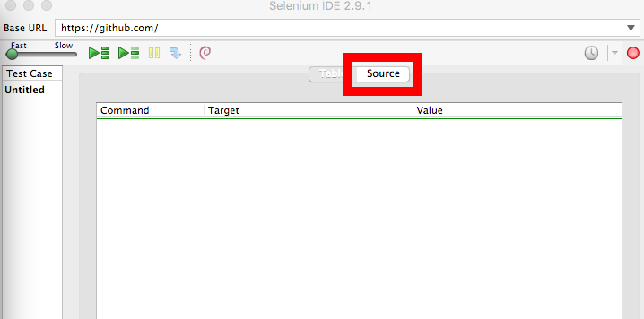
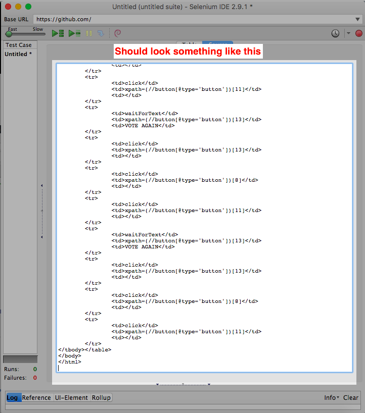
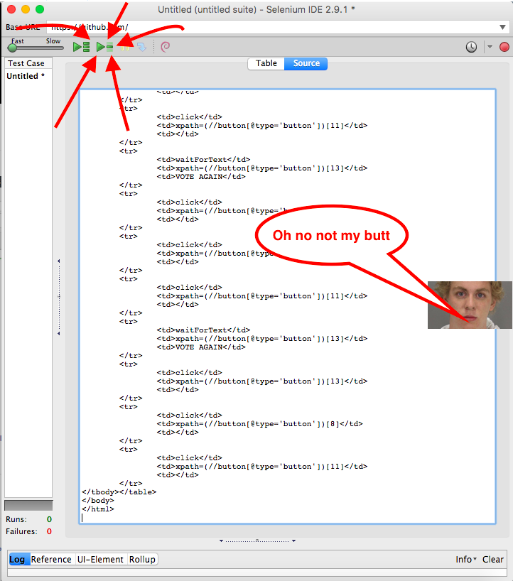

# Vote For Phil
How to automatically vote for Phil 100 times without getting carpal tunnel.

## First, get Selenium IDE for Firefox
Go to https://addons.mozilla.org/en-us/firefox/addon/selenium-ide/ and click the `Add to Firefox button`: 

## Next, open the Selenium
Click on tools then select `Selenium IDE`: 

## Next, copy and paste the script
1.  Click the `Source` tab: 

2.  Open the script by clicking on the link below:  https://raw.githubusercontent.com/bj97301/voteForPhil/master/voteForPhilSeleniumScript.html
3.  Select everything from the link above then copy it
4.  Paste all of it into the `Source` text area as shown below:
 

## Finally, run the script
1. Click on the `Table` tab to see the progress of the script 
 
2. Hit that fucking play button like it was brock the rapist's gaping asshole 
 
3. Also, feel free to thumbs up my comment so you can save other beautiful faces from getting carpal tunnel

Direct link to the script 
https://github.com/bj97301/voteForPhil/blob/master/voteForPhilSeleniumScript.html

Love ya, 
   -Bryan
